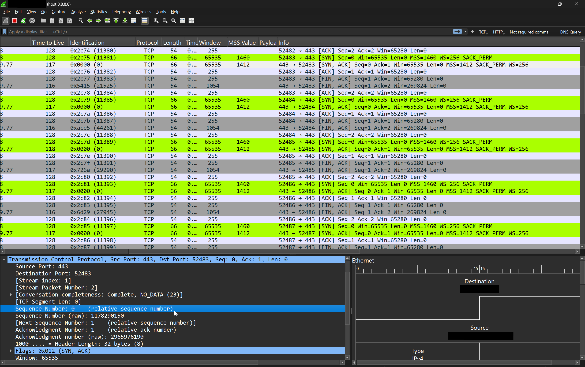

# 🛠️ TCP Profile for Wireshark – Optimized for Network & Security Engineers

Welcome to the **TCP Profile for Wireshark** – a customized Wireshark configuration that makes TCP packet analysis cleaner, faster, and more insightful for network and security professionals.

---

## 🔍 What is This?

This repository contains a Wireshark profile tailored for **TCP packet analysis**, designed to:

- Highlight key TCP flags and fields
- Improve readability of TCP sessions
- Speed up troubleshooting with pre-configured display filters, coloring rules, and column setups

---

## 📥 How to Use

1. **Download or Clone** this repository.
2. Locate your Wireshark profiles directory:

   - **Linux/macOS**: `~/.config/wireshark/profiles/`
   - **Windows**: `C:\Users\<YourUsername>\AppData\Roaming\Wireshark\profiles\`

3. Copy the `TCP_Profile` folder into the `profiles` directory.
4. Open Wireshark → Go to `Edit` → `Configuration Profiles` → Select `TCP_Profile`.

You're now ready to analyze with enhanced TCP visibility!

---

## 🚀 Features Included

✅ Customized columns: Source/Destination IPs, Ports, TCP Flags, Seq/Ack Numbers  
✅ Predefined display filters for fast troubleshooting  
✅ Helpful coloring rules to distinguish retransmissions, resets, and handshakes  
✅ Optimized layout for better visibility of TCP-specific fields

---

## 👤 Who Is This For?

This profile is ideal for:

- Network Engineers diagnosing TCP performance issues  
- Security Analysts investigating suspicious TCP sessions  
- Students learning TCP/IP stack behavior  
- Anyone who wants to save time during packet analysis

---

## 🧠 Why Use This?

Setting up Wireshark manually can be time-consuming. This ready-to-use profile:

- Reduces cognitive load  
- Highlights what's important in TCP flows  
- Speeds up your analysis process

---

## 📸 Screenshot Preview

Here’s a preview of the TCP Wireshark Profile in action:

> 🔧 *Shows custom columns, color rules for flags like SYN, ACK, RST, and efficient TCP stream view for deep analysis.*

---

## 🙌 Contributions
Got improvements or suggestions?
Feel free to fork this repo, submit a pull request, or open an issue.
